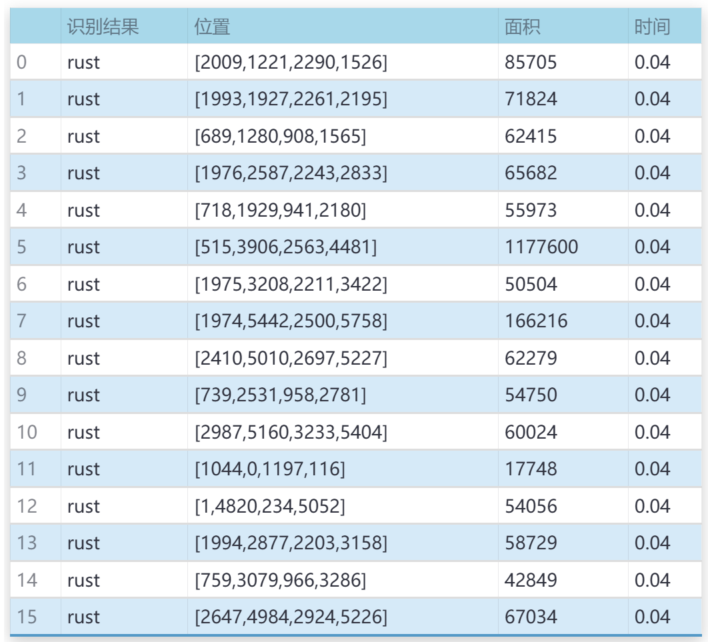

# 面包生产线残次品检测检测系统源码分享
 # [一条龙教学YOLOV8标注好的数据集一键训练_70+全套改进创新点发刊_Web前端展示]

### 1.研究背景与意义

项目参考[AAAI Association for the Advancement of Artificial Intelligence](https://gitee.com/qunshansj/projects)

项目来源[AACV Association for the Advancement of Computer Vision](https://gitee.com/qunmasj/projects)

研究背景与意义

随着食品工业的快速发展，面包作为一种广泛消费的主食，其生产过程的质量控制愈发受到重视。面包生产线的自动化和智能化不仅提高了生产效率，还确保了产品的质量。然而，在生产过程中，面包的外观缺陷如变形、缺陷、扁平等问题，常常导致产品的合格率下降，影响消费者的购买体验。因此，建立一个高效的残次品检测系统，对于提高面包生产线的整体质量水平具有重要的现实意义。

近年来，深度学习技术的迅猛发展为物体检测领域带来了新的机遇。YOLO（You Only Look Once）系列模型因其高效的实时检测能力，逐渐成为物体检测的主流方法。YOLOv8作为该系列的最新版本，结合了更为先进的特征提取和目标定位技术，能够在复杂的生产环境中实现高精度的目标检测。通过对YOLOv8模型的改进，可以更好地适应面包生产线的实际需求，提升对面包及其缺陷的检测能力。

本研究基于改进YOLOv8模型，构建面包生产线的残次品检测系统，旨在通过自动化的方式，实时监测生产线上的面包质量。为此，我们使用了一个包含2200张图像的数据集，该数据集涵盖了四类目标：正常面包、缺陷面包、扁平面包和莫斯科面包。这些类别的设置不仅反映了面包生产中的常见问题，也为模型的训练提供了丰富的样本。通过对这些图像的深入分析与处理，改进后的YOLOv8模型能够有效识别和分类不同类型的面包及其缺陷，从而实现对生产线的实时监控和质量控制。

本研究的意义不仅在于技术层面的创新，更在于其对食品安全和消费者权益的保护。通过高效的残次品检测系统，生产企业能够及时发现并剔除不合格产品，降低食品安全风险，提升品牌形象。同时，系统的应用将减少人工检测的工作量，提高生产效率，降低人力成本，促进面包生产线的智能化转型。

此外，研究成果还具有一定的推广价值。随着深度学习技术的不断进步，基于改进YOLOv8的检测系统可以应用于其他食品生产领域，推动整个食品工业的智能化发展。通过建立标准化的检测流程和数据集，可以为行业内其他企业提供参考和借鉴，进一步提升食品生产的整体质量水平。

综上所述，本研究不仅为面包生产线的质量控制提供了一种有效的技术手段，也为食品工业的智能化发展贡献了新的思路与方法。通过对YOLOv8模型的改进与应用，期待能够在提高生产效率的同时，保障消费者的食品安全与健康。

### 2.图片演示


##### 注意：由于此博客编辑较早，上面“2.图片演示”和“3.视频演示”展示的系统图片或者视频可能为老版本，新版本在老版本的基础上升级如下：（实际效果以升级的新版本为准）

  （1）适配了YOLOV8的“目标检测”模型和“实例分割”模型，通过加载相应的权重（.pt）文件即可自适应加载模型。

  （2）支持“图片识别”、“视频识别”、“摄像头实时识别”三种识别模式。

  （3）支持“图片识别”、“视频识别”、“摄像头实时识别”三种识别结果保存导出，解决手动导出（容易卡顿出现爆内存）存在的问题，识别完自动保存结果并导出到tempDir中。

  （4）支持Web前端系统中的标题、背景图等自定义修改，后面提供修改教程。

  另外本项目提供训练的数据集和训练教程,暂不提供权重文件（best.pt）,需要您按照教程进行训练后实现图片演示和Web前端界面演示的效果。

### 3.视频演示

[3.1 视频演示](https://www.bilibili.com/video/BV1mTpJeJERL/)

### 4.数据集信息展示

##### 4.1 本项目数据集详细数据（类别数＆类别名）

nc: 4
names: ['bread', 'defect', 'flat', 'moscow-bread']


##### 4.2 本项目数据集信息介绍

数据集信息展示

在现代工业生产中，尤其是在食品制造领域，确保产品质量至关重要。为了提升面包生产线的残次品检测效率，研究团队构建了一个名为“3 Bread Types”的数据集，旨在为改进YOLOv8模型提供高质量的训练数据。该数据集包含四个主要类别，分别是“bread”（面包）、“defect”（缺陷）、“flat”（扁平面包）和“moscow-bread”（莫斯科面包），这些类别的设计旨在涵盖面包生产过程中可能出现的各种情况，以便模型能够有效地识别和分类不同类型的面包及其缺陷。

“3 Bread Types”数据集的构建过程经过精心设计，确保了数据的多样性和代表性。首先，在数据采集阶段，研究团队从多个面包生产线收集了大量的图像，这些图像不仅包括正常的面包产品，还涵盖了各种缺陷类型。这些缺陷可能是由于生产过程中的不当操作、原材料质量问题或设备故障等因素造成的。通过对这些图像进行标注，研究团队能够为每个类别提供准确的标签，从而为后续的模型训练奠定基础。

在数据集的构成上，四个类别各自具有独特的特征。例如，“bread”类别代表了标准的面包产品，其图像通常展现了完美的外观和结构；而“defect”类别则包含了各种缺陷面包的图像，如表面裂纹、颜色不均匀等，这些缺陷可能会影响消费者的购买决策和品牌形象。“flat”类别则专注于那些在生产过程中未能达到预期高度的面包，这类产品在市场上通常被视为次品。而“moscow-bread”类别则特指一种特定类型的面包，其外观和口感具有独特的地方特色，这为模型的训练增加了更多的复杂性和挑战。

为了确保数据集的有效性和实用性，研究团队还进行了数据增强处理，包括旋转、缩放、裁剪和颜色调整等操作。这些技术手段不仅增加了数据集的多样性，还提高了模型在不同环境和条件下的鲁棒性。此外，数据集中的图像均经过高质量的拍摄和处理，确保了清晰度和细节的完整性，使得模型能够更好地学习到每个类别的特征。

在训练过程中，改进后的YOLOv8模型将利用“3 Bread Types”数据集进行学习，以识别和分类面包生产线上的产品。通过引入深度学习技术，模型能够快速、准确地检测出缺陷产品，从而提高生产效率，降低人工检测的成本。这不仅有助于提升产品质量，还能增强消费者的信任感，进而推动品牌的市场竞争力。

综上所述，“3 Bread Types”数据集的构建与应用，不仅为面包生产线的残次品检测提供了强有力的支持，也为相关领域的研究提供了宝贵的数据资源。通过持续的优化和改进，未来该数据集有望在更广泛的食品生产和质量控制领域发挥重要作用。


### 5.全套项目环境部署视频教程（零基础手把手教学）

[5.1 环境部署教程链接（零基础手把手教学）](https://www.ixigua.com/7404473917358506534?logTag=c807d0cbc21c0ef59de5)


[5.2 安装Python虚拟环境创建和依赖库安装视频教程链接（零基础手把手教学）](https://www.ixigua.com/7404474678003106304?logTag=1f1041108cd1f708b01a)

### 6.手把手YOLOV8训练视频教程（零基础小白有手就能学会）

[6.1 手把手YOLOV8训练视频教程（零基础小白有手就能学会）](https://www.ixigua.com/7404477157818401292?logTag=d31a2dfd1983c9668658)

### 7.70+种全套YOLOV8创新点代码加载调参视频教程（一键加载写好的改进模型的配置文件）

[7.1 70+种全套YOLOV8创新点代码加载调参视频教程（一键加载写好的改进模型的配置文件）](https://www.ixigua.com/7404478314661806627?logTag=29066f8288e3f4eea3a4)

### 8.70+种全套YOLOV8创新点原理讲解（非科班也可以轻松写刊发刊，V10版本正在科研待更新）

由于篇幅限制，每个创新点的具体原理讲解就不一一展开，具体见下列网址中的创新点对应子项目的技术原理博客网址【Blog】：


[8.1 70+种全套YOLOV8创新点原理讲解链接](https://gitee.com/qunmasj/good)

### 9.系统功能展示（检测对象为举例，实际内容以本项目数据集为准）

图9.1.系统支持检测结果表格显示

  图9.2.系统支持置信度和IOU阈值手动调节

  图9.3.系统支持自定义加载权重文件best.pt(需要你通过步骤5中训练获得)

  图9.4.系统支持摄像头实时识别

  图9.5.系统支持图片识别

  图9.6.系统支持视频识别

  图9.7.系统支持识别结果文件自动保存

  图9.8.系统支持Excel导出检测结果数据




### 10.原始YOLOV8算法原理

原始YOLOv8算法原理

YOLOv8算法是由Ultralytics团队在2023年1月推出的最新版本，它在YOLOv5的基础上，结合了近两年半的研究成果和实际应用中的反馈，进行了全面的优化和改进。YOLO系列算法以其快速的推理速度和较高的检测精度而闻名，而YOLOv8则在这些优点的基础上，进一步提升了性能，使其在目标检测领域中占据了重要地位。

YOLOv8的网络结构由三个主要部分组成：Backbone（骨干网络）、Neck（颈部结构）和Head（头部结构）。在Backbone部分，YOLOv8依然采用了深度卷积神经网络的架构，以提取输入图像中的特征信息。与之前的版本相比，YOLOv8在特征提取方面进行了细致的优化，特别是将C3模块替换为C2f模块。C2f模块引入了YOLOv7中的ELAN思想，增加了跳层连接的数量，这不仅丰富了梯度流的信息，还有效地减少了模型的计算复杂度，从而实现了轻量化设计。这种结构的变化使得YOLOv8在保持高效特征提取能力的同时，能够在更短的时间内完成计算。

在Neck部分，YOLOv8继续采用C2f模块替代了所有的C3模块，并且在上采样之前删除了两处卷积连接层。这一设计的目的是为了进一步提升特征融合的效率，确保在不同尺度下提取到的特征能够更好地进行整合，从而提高检测的准确性。YOLOv8在这一部分的改进，确保了特征的多样性和丰富性，使得模型在处理复杂场景时能够表现得更加出色。

YOLOv8的Head部分则引入了YOLOX中使用的解耦头的设计思路，采用了两条并行的分支结构，分别用于提取类别和位置特征。这种设计的核心在于分类任务和定位任务的侧重点不同，分类任务更关注特征图中提取到的特征与已有类别的相似性，而定位任务则更加关注边界框与真实框之间的关系。通过这种解耦的方式，YOLOv8能够在分类和定位的任务上实现更快的收敛速度和更高的预测精度。此外，YOLOv8还引入了无锚框结构，直接预测目标的中心，并利用任务对齐学习（Task Alignment Learning, TAL）来区分正负样本。通过引入分类分数和IOU的高次幂乘积作为衡量任务对齐程度的指标，YOLOv8在分类和定位损失函数中也引入了这一指标，从而实现了更为精确的检测结果。

在数据增强方面，YOLOv8在训练过程中对Mosaic数据增强的使用进行了反思。尽管Mosaic增强有助于提升模型的鲁棒性和泛化能力，但其在一定程度上也可能破坏数据的真实分布，导致模型学习到不良信息。因此，YOLOv8在训练的最后10个epoch中停止使用Mosaic数据增强，以确保模型能够更好地适应真实场景。

YOLOv8在检测性能上也取得了显著的成果。在COCO数据集上的实验表明，YOLOv8在同尺寸模型中，相较于其他YOLO系列模型，参数数量没有显著增加的情况下，取得了更高的精度。同时，YOLOv8在推理速度上也表现优异，显示出其在实时性和准确性之间的良好平衡。这些性能提升使得YOLOv8在各种应用场景中，尤其是在需要快速反应的实时检测任务中，展现出强大的竞争力。

总的来说，YOLOv8算法通过对网络结构的优化、特征提取的改进以及数据增强策略的调整，成功地提升了目标检测的精度和速度。其解耦头的设计和无锚框结构的引入，使得YOLOv8在分类和定位任务上能够更为高效地进行处理。作为当前目标检测领域的SOTA（State Of The Art）模型，YOLOv8不仅在学术研究中具有重要的价值，同时也在实际应用中展现出广泛的适用性和强大的性能。因此，YOLOv8的推出标志着目标检测技术的又一次重要进步，为未来的研究和应用提供了新的方向和可能性。


### 11.项目核心源码讲解（再也不用担心看不懂代码逻辑）

#### 11.1 70+种YOLOv8算法改进源码大全和调试加载训练教程（非必要）\ultralytics\models\sam\build.py

以下是经过简化和注释的核心代码部分，主要用于构建不同尺寸的Segment Anything Model (SAM)模型。代码中保留了重要的功能和结构，并添加了详细的中文注释。

```python
import torch
from functools import partial
from ultralytics.utils.downloads import attempt_download_asset
from .modules.decoders import MaskDecoder
from .modules.encoders import ImageEncoderViT, PromptEncoder
from .modules.sam import Sam
from .modules.tiny_encoder import TinyViT
from .modules.transformer import TwoWayTransformer

def build_sam_vit_h(checkpoint=None):
    """构建并返回一个高尺寸的Segment Anything Model (SAM)。"""
    return _build_sam(
        encoder_embed_dim=1280,  # 嵌入维度
        encoder_depth=32,         # 编码器深度
        encoder_num_heads=16,     # 注意力头数
        encoder_global_attn_indexes=[7, 15, 23, 31],  # 全局注意力索引
        checkpoint=checkpoint,     # 预训练模型路径
    )

def _build_sam(encoder_embed_dim, encoder_depth, encoder_num_heads, encoder_global_attn_indexes, checkpoint=None, mobile_sam=False):
    """构建选定的SAM模型架构。"""
    prompt_embed_dim = 256  # 提示嵌入维度
    image_size = 1024        # 输入图像大小
    vit_patch_size = 16      # ViT的补丁大小
    image_embedding_size = image_size // vit_patch_size  # 图像嵌入大小

    # 根据是否为移动SAM选择不同的图像编码器
    image_encoder = (TinyViT(
        img_size=image_size,
        in_chans=3,
        num_classes=1000,
        embed_dims=encoder_embed_dim,
        depths=encoder_depth,
        num_heads=encoder_num_heads,
        window_sizes=[7, 7, 14, 7],
        mlp_ratio=4.0,
        drop_rate=0.0,
        drop_path_rate=0.0,
        use_checkpoint=False,
        mbconv_expand_ratio=4.0,
        local_conv_size=3,
    ) if mobile_sam else ImageEncoderViT(
        depth=encoder_depth,
        embed_dim=encoder_embed_dim,
        img_size=image_size,
        mlp_ratio=4,
        norm_layer=partial(torch.nn.LayerNorm, eps=1e-6),
        num_heads=encoder_num_heads,
        patch_size=vit_patch_size,
        qkv_bias=True,
        use_rel_pos=True,
        global_attn_indexes=encoder_global_attn_indexes,
        window_size=14,
        out_chans=prompt_embed_dim,
    ))

    # 创建SAM模型
    sam = Sam(
        image_encoder=image_encoder,
        prompt_encoder=PromptEncoder(
            embed_dim=prompt_embed_dim,
            image_embedding_size=(image_embedding_size, image_embedding_size),
            input_image_size=(image_size, image_size),
            mask_in_chans=16,
        ),
        mask_decoder=MaskDecoder(
            num_multimask_outputs=3,
            transformer=TwoWayTransformer(
                depth=2,
                embedding_dim=prompt_embed_dim,
                mlp_dim=2048,
                num_heads=8,
            ),
            transformer_dim=prompt_embed_dim,
            iou_head_depth=3,
            iou_head_hidden_dim=256,
        ),
        pixel_mean=[123.675, 116.28, 103.53],  # 像素均值
        pixel_std=[58.395, 57.12, 57.375],      # 像素标准差
    )

    # 如果提供了检查点，则加载预训练权重
    if checkpoint is not None:
        checkpoint = attempt_download_asset(checkpoint)  # 尝试下载资产
        with open(checkpoint, 'rb') as f:
            state_dict = torch.load(f)  # 加载状态字典
        sam.load_state_dict(state_dict)  # 加载模型权重
    sam.eval()  # 设置模型为评估模式
    return sam  # 返回构建的SAM模型

# SAM模型映射字典
sam_model_map = {
    'sam_h.pt': build_sam_vit_h,
    # 其他模型构建函数可以在这里添加
}

def build_sam(ckpt='sam_b.pt'):
    """根据给定的检查点构建SAM模型。"""
    model_builder = None
    ckpt = str(ckpt)  # 将检查点转换为字符串类型
    for k in sam_model_map.keys():
        if ckpt.endswith(k):  # 检查给定的检查点是否支持
            model_builder = sam_model_map.get(k)

    if not model_builder:
        raise FileNotFoundError(f'{ckpt} 不是一个支持的SAM模型。可用模型有: \n {sam_model_map.keys()}')

    return model_builder(ckpt)  # 返回构建的模型
```

### 代码说明：
1. **构建函数**：`build_sam_vit_h`等函数用于构建不同尺寸的SAM模型，调用`_build_sam`函数并传入相应的参数。
2. **模型构建**：`_build_sam`函数是核心函数，负责创建图像编码器、提示编码器和掩码解码器，并将它们组合成一个完整的SAM模型。
3. **检查点加载**：如果提供了预训练模型的路径，函数会尝试加载这些权重，以便在评估时使用。
4. **模型映射**：`sam_model_map`字典将模型名称映射到构建函数，以便根据输入的检查点名称选择合适的构建函数。

这个文件是用于构建Segment Anything Model（SAM）的代码，主要包括不同尺寸的模型构建函数和一些辅助函数。代码的核心功能是根据不同的参数配置，构建出不同版本的SAM模型，并支持从预训练的检查点加载模型权重。

首先，文件导入了一些必要的库和模块，包括`torch`和一些自定义的模块，如`MaskDecoder`、`ImageEncoderViT`、`PromptEncoder`等。这些模块是实现SAM模型的关键组成部分。

接下来，定义了几个函数来构建不同尺寸的SAM模型，包括`build_sam_vit_h`、`build_sam_vit_l`和`build_sam_vit_b`，分别对应高（h）、大（l）和基础（b）尺寸的模型。这些函数内部调用了一个私有函数`_build_sam`，并传入相应的参数配置，如编码器的嵌入维度、深度、头数和全局注意力索引等。

`build_mobile_sam`函数则用于构建移动端的SAM模型，适合在资源受限的环境中使用。与其他模型不同的是，它的参数是以列表的形式传入，以适应不同层次的特征提取。

`_build_sam`函数是构建SAM模型的核心逻辑。它根据传入的参数创建一个图像编码器（可以是`TinyViT`或`ImageEncoderViT`），并结合`PromptEncoder`和`MaskDecoder`来构建完整的SAM模型。函数中还定义了一些图像处理的参数，如图像大小、嵌入维度等。

在模型构建完成后，如果提供了检查点路径，代码会尝试下载并加载预训练的模型权重，以便于模型的使用和推理。最后，模型会被设置为评估模式（`eval`），准备进行推理。

文件的最后部分定义了一个字典`samm_model_map`，将模型名称映射到相应的构建函数，以便于根据指定的检查点名称快速构建相应的模型。`build_sam`函数则是用户接口，允许用户通过指定检查点名称来构建所需的SAM模型。如果指定的检查点不在支持的模型列表中，函数会抛出一个文件未找到的异常。

总的来说，这个文件的主要功能是提供一种灵活的方式来构建和加载不同配置的SAM模型，适用于各种应用场景。

#### 11.2 code\ultralytics\models\sam\modules\tiny_encoder.py

以下是经过简化并添加详细中文注释的核心代码部分：

```python
import torch
import torch.nn as nn
import torch.nn.functional as F

class Conv2d_BN(torch.nn.Sequential):
    """一个顺序容器，执行2D卷积操作，后接批量归一化。"""

    def __init__(self, in_channels, out_channels, kernel_size=1, stride=1, padding=0):
        """初始化卷积层和批量归一化层。"""
        super().__init__()
        # 添加卷积层
        self.add_module("conv", torch.nn.Conv2d(in_channels, out_channels, kernel_size, stride, padding, bias=False))
        # 添加批量归一化层
        self.add_module("bn", torch.nn.BatchNorm2d(out_channels))

class PatchEmbed(nn.Module):
    """将图像嵌入为补丁，并将其投影到指定的嵌入维度。"""

    def __init__(self, in_chans, embed_dim, resolution, activation):
        """初始化补丁嵌入层。"""
        super().__init__()
        img_size = (resolution, resolution)  # 假设输入为正方形图像
        self.patches_resolution = (img_size[0] // 4, img_size[1] // 4)  # 每个补丁的分辨率
        self.seq = nn.Sequential(
            Conv2d_BN(in_chans, embed_dim // 2, kernel_size=3, stride=2, padding=1),
            activation(),
            Conv2d_BN(embed_dim // 2, embed_dim, kernel_size=3, stride=2, padding=1),
        )

    def forward(self, x):
        """通过补丁嵌入层处理输入张量。"""
        return self.seq(x)

class TinyViT(nn.Module):
    """TinyViT架构，用于视觉任务。"""

    def __init__(self, img_size=224, in_chans=3, num_classes=1000, embed_dims=[96, 192, 384, 768], depths=[2, 2, 6, 2]):
        """初始化TinyViT模型。"""
        super().__init__()
        self.img_size = img_size
        self.num_classes = num_classes

        # 初始化补丁嵌入层
        self.patch_embed = PatchEmbed(in_chans=in_chans, embed_dim=embed_dims[0], resolution=img_size, activation=nn.GELU)

        # 构建层
        self.layers = nn.ModuleList()
        for i_layer in range(len(depths)):
            layer = nn.ModuleList([Conv2d_BN(embed_dims[i_layer], embed_dims[i_layer], kernel_size=3, stride=1, padding=1) for _ in range(depths[i_layer])])
            self.layers.append(layer)

        # 分类头
        self.head = nn.Linear(embed_dims[-1], num_classes) if num_classes > 0 else nn.Identity()

    def forward(self, x):
        """执行前向传播。"""
        x = self.patch_embed(x)  # 通过补丁嵌入层
        for layer in self.layers:
            for blk in layer:
                x = blk(x)  # 通过每个卷积块
        return self.head(x)  # 通过分类头
```

### 代码说明：
1. **Conv2d_BN**: 该类实现了一个卷积层后接批量归一化的结构，便于构建深度学习模型时的常见操作。
2. **PatchEmbed**: 该类负责将输入图像分割成补丁，并通过卷积层将其嵌入到指定的维度。这里的补丁分辨率是输入图像分辨率的四分之一。
3. **TinyViT**: 这是整个模型的主类，负责初始化补丁嵌入层和多个卷积层，最后通过一个线性层进行分类。它接受图像大小、输入通道数、类别数、嵌入维度和每层的深度等参数。

### 主要功能：
- 该模型主要用于图像分类任务，通过将图像嵌入为补丁并进行卷积操作来提取特征，最后通过分类头输出预测结果。

这个程序文件定义了一个名为 `TinyViT` 的视觉模型架构，主要用于图像处理任务。它的设计灵感来源于其他模型，如 LeViT 和 Swin Transformer。整个文件包含多个类，每个类负责模型的不同部分，包括卷积层、注意力机制、MLP（多层感知机）等。

首先，文件导入了必要的库，包括 PyTorch 和一些工具函数。接着，定义了几个基础组件。`Conv2d_BN` 类实现了一个顺序容器，包含二维卷积和批量归一化。`PatchEmbed` 类则将输入图像分割成小块，并将其嵌入到指定的维度中。

`MBConv` 类实现了移动反向瓶颈卷积层，这是 EfficientNet 架构的一部分。它通过一系列卷积和激活函数处理输入，并在训练时应用 DropPath。`PatchMerging` 类用于合并特征图中的相邻块，并将其投影到新的维度。

`ConvLayer` 类是一个卷积层，包含多个 MBConv 层，并支持下采样和梯度检查点。`Mlp` 类实现了一个多层感知机，包含层归一化和两个全连接层。`Attention` 类实现了多头注意力机制，支持空间意识，并为每个唯一的空间位置偏移量应用可训练的注意力偏置。

`TinyViTBlock` 类是 TinyViT 的基本构建块，结合了自注意力和局部卷积。`BasicLayer` 类则是 TinyViT 的一个基本层，包含多个 TinyViTBlock。

`LayerNorm2d` 类实现了二维层归一化。最后，`TinyViT` 类是整个模型的主类，负责初始化模型的各个部分，包括图像嵌入、各层的构建、分类头等。它还实现了前向传播方法，处理输入并返回输出。

整个模型的设计考虑了可扩展性，允许用户根据需要调整嵌入维度、层数、注意力头数等参数。通过这种方式，TinyViT 可以适应不同的视觉任务和数据集。

#### 11.3 ui.py

```python
import sys
import subprocess

def run_script(script_path):
    """
    使用当前 Python 环境运行指定的脚本。

    Args:
        script_path (str): 要运行的脚本路径

    Returns:
        None
    """
    # 获取当前 Python 解释器的路径
    python_path = sys.executable

    # 构建运行命令，使用 streamlit 运行指定的脚本
    command = f'"{python_path}" -m streamlit run "{script_path}"'

    # 执行命令并等待其完成
    result = subprocess.run(command, shell=True)
    
    # 检查命令执行结果，如果返回码不为0，表示出错
    if result.returncode != 0:
        print("脚本运行出错。")


# 主程序入口
if __name__ == "__main__":
    # 指定要运行的脚本路径
    script_path = "web.py"  # 这里可以直接指定脚本名，假设在当前目录下

    # 调用函数运行脚本
    run_script(script_path)
```

### 代码注释说明：
1. **导入模块**：
   - `sys`：用于获取当前 Python 解释器的路径。
   - `subprocess`：用于执行外部命令。

2. **`run_script` 函数**：
   - 功能：接受一个脚本路径，使用当前 Python 环境运行该脚本。
   - 参数：`script_path`，字符串类型，表示要运行的脚本的路径。
   - 返回值：无。

3. **获取 Python 解释器路径**：
   - 使用 `sys.executable` 获取当前 Python 解释器的完整路径。

4. **构建命令**：
   - 使用 `streamlit` 模块运行指定的脚本，命令格式为 `python -m streamlit run script_path`。

5. **执行命令**：
   - 使用 `subprocess.run` 执行构建的命令，并等待其完成。

6. **检查执行结果**：
   - 如果命令返回码不为0，表示脚本运行出错，打印错误信息。

7. **主程序入口**：
   - 使用 `if __name__ == "__main__":` 确保代码块仅在直接运行该脚本时执行。
   - 指定要运行的脚本路径，并调用 `run_script` 函数执行该脚本。

这个程序文件的主要功能是通过当前的 Python 环境来运行一个指定的脚本，具体来说是一个名为 `web.py` 的脚本。程序首先导入了必要的模块，包括 `sys`、`os` 和 `subprocess`，以及一个自定义的路径处理模块 `abs_path`。

在 `run_script` 函数中，首先获取当前 Python 解释器的路径，这样可以确保使用正确的 Python 环境来执行脚本。接着，构建一个命令字符串，这个命令将调用 `streamlit` 来运行指定的脚本。`streamlit` 是一个用于构建数据应用的库，通常用于快速开发和展示数据可视化的应用。

然后，使用 `subprocess.run` 方法来执行这个命令。该方法会在一个新的 shell 中运行命令，并等待其完成。如果命令执行的返回码不为零，表示脚本运行出错，程序会输出一条错误信息。

在文件的最后部分，使用 `if __name__ == "__main__":` 语句来确保只有在直接运行该文件时才会执行后面的代码。在这里，指定了要运行的脚本路径为 `web.py`，并调用 `run_script` 函数来执行这个脚本。

总的来说，这个程序提供了一种简便的方式来运行一个特定的 Python 脚本，并能够处理运行过程中的错误。

#### 11.4 70+种YOLOv8算法改进源码大全和调试加载训练教程（非必要）\ultralytics\nn\backbone\CSwomTramsformer.py

以下是经过简化并注释的核心代码部分，主要保留了模型的结构和前向传播逻辑。

```python
import torch
import torch.nn as nn
import numpy as np

class Mlp(nn.Module):
    """多层感知机（MLP）模块"""
    def __init__(self, in_features, hidden_features=None, out_features=None, act_layer=nn.GELU, drop=0.):
        super().__init__()
        out_features = out_features or in_features  # 输出特征数
        hidden_features = hidden_features or in_features  # 隐藏层特征数
        self.fc1 = nn.Linear(in_features, hidden_features)  # 第一层线性变换
        self.act = act_layer()  # 激活函数
        self.fc2 = nn.Linear(hidden_features, out_features)  # 第二层线性变换
        self.drop = nn.Dropout(drop)  # Dropout层

    def forward(self, x):
        """前向传播"""
        x = self.fc1(x)  # 线性变换
        x = self.act(x)  # 激活
        x = self.drop(x)  # Dropout
        x = self.fc2(x)  # 线性变换
        x = self.drop(x)  # Dropout
        return x

class CSWinBlock(nn.Module):
    """CSWin Transformer的基本块"""
    def __init__(self, dim, num_heads, mlp_ratio=4., drop=0., attn_drop=0.):
        super().__init__()
        self.dim = dim  # 输入特征维度
        self.num_heads = num_heads  # 注意力头数
        self.mlp_ratio = mlp_ratio  # MLP的隐藏层比例
        self.qkv = nn.Linear(dim, dim * 3)  # 线性变换生成Q、K、V
        self.norm1 = nn.LayerNorm(dim)  # 第一层归一化
        self.attn = LePEAttention(dim, num_heads=num_heads, attn_drop=attn_drop)  # 注意力模块
        self.mlp = Mlp(in_features=dim, hidden_features=int(dim * mlp_ratio), out_features=dim)  # MLP模块
        self.norm2 = nn.LayerNorm(dim)  # 第二层归一化

    def forward(self, x):
        """前向传播"""
        x = self.norm1(x)  # 归一化
        qkv = self.qkv(x).reshape(x.shape[0], -1, 3, self.dim).permute(2, 0, 1, 3)  # 生成Q、K、V
        x = self.attn(qkv)  # 注意力计算
        x = x + self.mlp(self.norm2(x))  # 加上MLP的输出
        return x

class CSWinTransformer(nn.Module):
    """CSWin Transformer模型"""
    def __init__(self, img_size=640, in_chans=3, num_classes=1000, embed_dim=96, depth=[2, 2, 6, 2], num_heads=12):
        super().__init__()
        self.num_classes = num_classes
        self.embed_dim = embed_dim  # 嵌入维度
        self.stage1_conv_embed = nn.Sequential(
            nn.Conv2d(in_chans, embed_dim, 7, 4, 2),  # 卷积嵌入
            nn.LayerNorm(embed_dim)  # 归一化
        )
        self.stage1 = nn.ModuleList([
            CSWinBlock(dim=embed_dim, num_heads=num_heads) for _ in range(depth[0])  # 第一阶段的多个CSWinBlock
        ])
        # 后续阶段的定义省略...

    def forward(self, x):
        """前向传播"""
        x = self.stage1_conv_embed(x)  # 嵌入
        for blk in self.stage1:
            x = blk(x)  # 通过每个块
        return x

# 使用示例
if __name__ == '__main__':
    inputs = torch.randn((1, 3, 640, 640))  # 输入数据
    model = CSWinTransformer()  # 初始化模型
    res = model(inputs)  # 前向传播
    print(res.size())  # 输出结果的尺寸
```

### 代码说明：
1. **Mlp类**：实现了一个简单的多层感知机，包含两个线性层和一个激活函数，支持Dropout。
2. **CSWinBlock类**：实现了CSWin Transformer的基本块，包含注意力机制和MLP，使用LayerNorm进行归一化。
3. **CSWinTransformer类**：构建了整个CSWin Transformer模型，包含输入嵌入和多个CSWinBlock。
4. **前向传播**：通过模型的前向传播函数，可以得到输入数据的特征表示。

注意：这里省略了一些细节和后续阶段的实现，主要聚焦于核心结构和功能。

该程序文件实现了CSWin Transformer模型的结构，主要用于计算机视觉任务。代码首先导入了必要的库，包括PyTorch和一些辅助模块。文件的开头部分包含版权信息和作者信息。

在模型的实现中，首先定义了一个多层感知机（Mlp）类，它包含两个全连接层和一个激活函数（默认为GELU），用于特征的非线性变换。

接下来定义了LePEAttention类，该类实现了一种特殊的注意力机制，称为局部增强位置编码（LePE）。该类通过将输入的特征图转换为窗口形式，计算注意力权重，并结合位置编码进行特征提取。其核心方法包括im2cswin和get_lepe，分别用于将输入图像转换为窗口形式和获取位置编码。

CSWinBlock类是模型的基本构建块，包含了LePEAttention和多层感知机。它通过规范化和残差连接来增强特征的表达能力。该类的构造函数根据输入参数设置注意力头的数量、分支数量等。

CSWinTransformer类是整个模型的主体，负责构建多个CSWinBlock的堆叠结构。它的构造函数接受多个参数，包括图像大小、嵌入维度、深度等，并根据这些参数构建不同阶段的网络结构。每个阶段由多个CSWinBlock和合并块（Merge_Block）组成，合并块用于调整特征图的维度。

此外，程序还定义了一些辅助函数，如img2windows和windows2img，用于在图像和窗口之间进行转换。

最后，程序提供了几个模型的构造函数（CSWin_tiny、CSWin_small、CSWin_base、CSWin_large），允许用户根据需要选择不同规模的模型，并可选择加载预训练权重。

在主函数中，代码示例展示了如何创建不同规模的CSWin Transformer模型，并对随机生成的输入进行前向传播，输出每个阶段的特征图大小。

整体而言，该文件实现了CSWin Transformer的核心结构和功能，适用于图像分类等视觉任务。

#### 11.5 70+种YOLOv8算法改进源码大全和调试加载训练教程（非必要）\ultralytics\nn\extra_modules\head.py

以下是代码中最核心的部分，并附上详细的中文注释：

```python
import torch
import torch.nn as nn
from ultralytics.utils.tal import dist2bbox, make_anchors

class Detect_DyHead(nn.Module):
    """YOLOv8 检测头，使用 DyHead 进行目标检测。"""
    
    def __init__(self, nc=80, hidc=256, block_num=2, ch=()):
        super().__init__()
        self.nc = nc  # 类别数量
        self.nl = len(ch)  # 检测层数量
        self.reg_max = 16  # DFL 通道数
        self.no = nc + self.reg_max * 4  # 每个锚点的输出数量
        self.stride = torch.zeros(self.nl)  # 构建时计算的步幅
        # 定义卷积层
        self.conv = nn.ModuleList(nn.Sequential(Conv(x, hidc, 1)) for x in ch)
        self.dyhead = nn.Sequential(*[DyHeadBlock(hidc) for _ in range(block_num)])  # DyHead 模块
        self.cv2 = nn.ModuleList(
            nn.Sequential(Conv(hidc, hidc // 4, 3), Conv(hidc // 4, hidc // 4, 3), nn.Conv2d(hidc // 4, 4 * self.reg_max, 1)) for _ in ch)
        self.cv3 = nn.ModuleList(nn.Sequential(Conv(hidc, max(ch[0], self.nc), 3), Conv(max(ch[0], self.nc), max(ch[0], self.nc), 3), nn.Conv2d(max(ch[0], self.nc), self.nc, 1)) for _ in ch)
        self.dfl = DFL(self.reg_max) if self.reg_max > 1 else nn.Identity()  # DFL 模块

    def forward(self, x):
        """连接并返回预测的边界框和类别概率。"""
        for i in range(self.nl):
            x[i] = self.conv[i](x[i])  # 通过卷积层处理输入
        x = self.dyhead(x)  # 通过 DyHead 模块处理
        shape = x[0].shape  # 获取输出形状
        for i in range(self.nl):
            # 将两个卷积层的输出连接在一起
            x[i] = torch.cat((self.cv2[i](x[i]), self.cv3[i](x[i])), 1)
        if self.training:
            return x  # 如果是训练模式，返回处理后的输出
        # 动态调整锚点和步幅
        self.anchors, self.strides = (x.transpose(0, 1) for x in make_anchors(x, self.stride, 0.5))
        x_cat = torch.cat([xi.view(shape[0], self.no, -1) for xi in x], 2)  # 将所有输出连接在一起
        box, cls = x_cat.split((self.reg_max * 4, self.nc), 1)  # 分割边界框和类别
        dbox = dist2bbox(self.dfl(box), self.anchors.unsqueeze(0), xywh=True, dim=1) * self.strides  # 计算真实边界框
        y = torch.cat((dbox, cls.sigmoid()), 1)  # 返回边界框和类别概率
        return y

    def bias_init(self):
        """初始化 Detect() 的偏置，警告：需要步幅可用。"""
        for a, b, s in zip(self.cv2, self.cv3, self.stride):
            a[-1].bias.data[:] = 1.0  # 边界框偏置初始化
            b[-1].bias.data[:self.nc] = math.log(5 / self.nc / (640 / s) ** 2)  # 类别偏置初始化

# 其他类可以在此基础上扩展，具体实现略去
```

### 代码核心部分解释：
1. **Detect_DyHead 类**：这是 YOLOv8 检测头的核心类，负责处理输入特征并输出边界框和类别概率。
2. **初始化方法 `__init__`**：定义了模型的基本参数，包括类别数量、检测层数量、DFL 通道数等，并初始化卷积层和 DyHead 模块。
3. **前向传播方法 `forward`**：实现了特征的处理流程，包括卷积、DyHead 处理、锚点生成、边界框和类别的计算。
4. **偏置初始化方法 `bias_init`**：用于初始化模型的偏置，确保模型在训练开始时有一个合理的起点。

以上是代码的核心部分和详细注释，其他类可以根据需要进行扩展和修改。

该程序文件定义了YOLOv8模型中的检测头部分，主要用于目标检测任务。文件中包含多个类，每个类实现了不同的检测头结构，具体包括动态头（Detect_DyHead）、自适应特征金字塔网络（AFPN）头以及高效检测头（Detect_Efficient）等。这些类都继承自PyTorch的`nn.Module`，并实现了前向传播和偏置初始化等功能。

在`Detect_DyHead`类中，构造函数初始化了类的基本参数，包括类别数量、隐藏通道数、块数量等。该类的前向传播方法接收输入特征图，经过一系列卷积操作和动态头模块的处理，最终输出预测的边界框和类别概率。在训练模式下，返回的是特征图；在推理模式下，会根据输入形状动态生成锚框，并返回边界框和类别概率。

`Detect_DyHeadWithDCNV3`类是对`Detect_DyHead`的扩展，使用了DCN（Deformable Convolutional Networks）来增强特征提取能力。

`Detect_AFPN_P345`和`Detect_AFPN_P2345`类实现了基于自适应特征金字塔网络的检测头，能够更好地处理不同尺度的目标。它们的构造函数中初始化了AFPN模块，并在前向传播中通过AFPN处理输入特征图，最终输出预测结果。

`Detect_Efficient`类则实现了一种高效的检测头结构，采用了不同的卷积策略以减少计算量，同时保持较高的检测精度。该类的前向传播方法同样会处理输入特征图并输出预测结果。

`DetectAux`类则实现了带有辅助头的检测模块，能够在训练时输出更多的信息以帮助模型学习。

最后，`Segment_Efficient`类是一个用于分割任务的检测头，扩展了高效检测头的功能，增加了对掩膜的处理。

整个文件的设计思路是通过模块化的方式实现不同的检测头，便于在YOLOv8模型中进行灵活的组合和扩展，以适应不同的任务需求。

#### 11.6 train.py

以下是代码中最核心的部分，并附上详细的中文注释：

```python
class DetectionTrainer(BaseTrainer):
    """
    DetectionTrainer类扩展了BaseTrainer类，用于基于检测模型的训练。
    """

    def build_dataset(self, img_path, mode="train", batch=None):
        """
        构建YOLO数据集。

        参数:
            img_path (str): 包含图像的文件夹路径。
            mode (str): 模式，可以是'train'或'val'，用户可以为每种模式自定义不同的增强。
            batch (int, optional): 批次大小，仅用于'rect'模式。默认为None。
        """
        gs = max(int(de_parallel(self.model).stride.max() if self.model else 0), 32)
        return build_yolo_dataset(self.args, img_path, batch, self.data, mode=mode, rect=mode == "val", stride=gs)

    def get_dataloader(self, dataset_path, batch_size=16, rank=0, mode="train"):
        """构造并返回数据加载器。"""
        assert mode in ["train", "val"]  # 确保模式有效
        with torch_distributed_zero_first(rank):  # 仅在DDP中初始化数据集*.cache一次
            dataset = self.build_dataset(dataset_path, mode, batch_size)  # 构建数据集
        shuffle = mode == "train"  # 训练模式下打乱数据
        if getattr(dataset, "rect", False) and shuffle:
            LOGGER.warning("WARNING ⚠️ 'rect=True'与DataLoader的shuffle不兼容，设置shuffle=False")
            shuffle = False  # 如果使用rect模式，则不打乱数据
        workers = self.args.workers if mode == "train" else self.args.workers * 2  # 设置工作线程数
        return build_dataloader(dataset, batch_size, workers, shuffle, rank)  # 返回数据加载器

    def preprocess_batch(self, batch):
        """对一批图像进行预处理，包括缩放和转换为浮点数。"""
        batch["img"] = batch["img"].to(self.device, non_blocking=True).float() / 255  # 将图像转换为浮点数并归一化
        if self.args.multi_scale:  # 如果启用多尺度
            imgs = batch["img"]
            sz = (
                random.randrange(self.args.imgsz * 0.5, self.args.imgsz * 1.5 + self.stride)
                // self.stride
                * self.stride
            )  # 随机选择新的图像大小
            sf = sz / max(imgs.shape[2:])  # 计算缩放因子
            if sf != 1:  # 如果缩放因子不为1
                ns = [
                    math.ceil(x * sf / self.stride) * self.stride for x in imgs.shape[2:]
                ]  # 计算新的形状
                imgs = nn.functional.interpolate(imgs, size=ns, mode="bilinear", align_corners=False)  # 进行插值缩放
            batch["img"] = imgs  # 更新图像
        return batch  # 返回处理后的批次

    def get_model(self, cfg=None, weights=None, verbose=True):
        """返回YOLO检测模型。"""
        model = DetectionModel(cfg, nc=self.data["nc"], verbose=verbose and RANK == -1)  # 创建检测模型
        if weights:
            model.load(weights)  # 加载权重
        return model  # 返回模型

    def get_validator(self):
        """返回用于YOLO模型验证的DetectionValidator。"""
        self.loss_names = "box_loss", "cls_loss", "dfl_loss"  # 定义损失名称
        return yolo.detect.DetectionValidator(
            self.test_loader, save_dir=self.save_dir, args=copy(self.args), _callbacks=self.callbacks
        )  # 返回验证器

    def plot_training_samples(self, batch, ni):
        """绘制带有注释的训练样本。"""
        plot_images(
            images=batch["img"],
            batch_idx=batch["batch_idx"],
            cls=batch["cls"].squeeze(-1),
            bboxes=batch["bboxes"],
            paths=batch["im_file"],
            fname=self.save_dir / f"train_batch{ni}.jpg",
            on_plot=self.on_plot,
        )  # 绘制图像并保存

    def plot_metrics(self):
        """从CSV文件绘制指标。"""
        plot_results(file=self.csv, on_plot=self.on_plot)  # 保存结果图像
```

### 代码核心部分说明：
1. **DetectionTrainer类**：这是一个用于训练YOLO检测模型的类，继承自BaseTrainer。
2. **build_dataset方法**：用于构建YOLO数据集，支持训练和验证模式。
3. **get_dataloader方法**：构造数据加载器，支持多线程和数据打乱。
4. **preprocess_batch方法**：对输入的图像批次进行预处理，包括归一化和多尺度调整。
5. **get_model方法**：创建并返回YOLO检测模型，可以加载预训练权重。
6. **get_validator方法**：返回用于模型验证的检测验证器。
7. **plot_training_samples和plot_metrics方法**：用于可视化训练样本和训练指标。

这个程序文件 `train.py` 是一个用于训练 YOLO（You Only Look Once）目标检测模型的实现，基于 Ultralytics 的 YOLO 框架。文件中定义了一个名为 `DetectionTrainer` 的类，该类继承自 `BaseTrainer`，并专门用于处理目标检测任务。

在类的构造函数中，首先会初始化一些基本参数。然后，`build_dataset` 方法用于构建 YOLO 数据集。该方法接收图像路径、模式（训练或验证）以及批量大小作为参数。它会根据模型的步幅计算合适的图像大小，并调用 `build_yolo_dataset` 函数来生成数据集。

`get_dataloader` 方法则用于创建数据加载器。它会根据传入的模式（训练或验证）来构建数据集，并根据需要设置是否打乱数据。对于训练模式，加载器会随机打乱数据，而在验证模式下则不会。

在数据预处理方面，`preprocess_batch` 方法负责将输入的图像批次进行缩放和转换为浮点数格式。它还支持多尺度训练，通过随机选择图像大小来增强模型的鲁棒性。

`set_model_attributes` 方法用于设置模型的属性，包括类别数量和类别名称等。这些信息会被附加到模型中，以便在训练过程中使用。

`get_model` 方法返回一个 YOLO 检测模型实例，并可以选择加载预训练权重。`get_validator` 方法则返回一个用于模型验证的 `DetectionValidator` 实例，以便在训练后评估模型的性能。

在训练过程中，`label_loss_items` 方法用于返回带有标签的损失字典，方便跟踪训练损失。`progress_string` 方法则生成一个格式化的字符串，用于显示训练进度，包括当前的轮次、GPU 内存使用情况、损失值、实例数量和图像大小等信息。

此外，`plot_training_samples` 方法用于绘制训练样本及其标注，便于可视化训练数据的质量。`plot_metrics` 方法则用于从 CSV 文件中绘制训练过程中的各种指标，生成结果图像。最后，`plot_training_labels` 方法创建一个带标签的训练图，展示模型在训练集上的表现。

整体而言，这个文件提供了一个完整的训练流程，涵盖了数据加载、预处理、模型构建、训练监控和结果可视化等多个方面，旨在帮助用户高效地训练 YOLO 目标检测模型。

### 12.系统整体结构（节选）

### 整体功能和架构概括

该项目是一个基于YOLOv8目标检测模型的实现，包含多个模块和文件，旨在提供灵活、高效的目标检测和图像分割功能。整体架构由多个部分组成，包括模型构建、训练、推理、数据处理和可视化等。以下是各个模块的主要功能：

1. **模型构建**：包括YOLOv8及其改进版本的检测头、特征提取器和分割模型的构建。
2. **训练流程**：提供训练模型的完整流程，包括数据加载、预处理、损失计算和训练监控。
3. **推理和预测**：实现对输入图像的推理，输出检测结果和分割掩膜。
4. **可视化**：支持训练过程中的损失和指标可视化，帮助用户理解模型的学习情况。
5. **用户界面**：提供简单的用户界面以便于运行和管理训练任务。

### 文件功能整理表

| 文件路径                                                                 | 功能描述                                                                                   |
|--------------------------------------------------------------------------|------------------------------------------------------------------------------------------|
| `ultralytics/models/sam/build.py`                                       | 构建Segment Anything Model（SAM），支持不同尺寸的模型和预训练权重加载。                       |
| `ultralytics/models/sam/modules/tiny_encoder.py`                       | 实现TinyViT模型的结构，包括卷积层、注意力机制和多层感知机等。                             |
| `ui.py`                                                                 | 提供一个用户界面，允许用户通过命令行运行指定的脚本（如`web.py`）。                         |
| `ultralytics/nn/backbone/CSwomTransformer.py`                          | 实现CSWin Transformer模型结构，适用于图像分类和目标检测任务。                             |
| `ultralytics/nn/extra_modules/head.py`                                 | 定义YOLOv8的检测头，包括动态头、自适应特征金字塔网络和高效检测头等。                       |
| `train.py`                                                              | 负责训练YOLO目标检测模型的主要逻辑，包括数据加载、预处理、模型训练和监控。               |
| `ultralytics/__init__.py`                                              | 初始化包，可能包含一些全局配置和模块导入。                                               |
| `ultralytics/models/yolo/segment/train.py`                             | 处理YOLO分割模型的训练逻辑，类似于`train.py`，但专注于分割任务。                           |
| `ultralytics/utils/callbacks/comet.py`                                 | 实现与Comet.ml的集成，用于记录和可视化训练过程中的指标和参数。                           |
| `ultralytics/engine/tuner.py`                                          | 提供模型调优的功能，可能包括超参数优化和模型选择等。                                     |
| `ultralytics/models/sam/__init__.py`                                   | 初始化SAM模块，可能包含模型和功能的导入。                                               |
| `ultralytics/models/yolo/pose/predict.py`                              | 实现YOLO姿态估计模型的推理逻辑，处理输入并输出姿态估计结果。                             |
| `ultralytics/nn/extra_modules/__init__.py`                             | 初始化额外模块，可能包含检测头和其他扩展功能的导入。                                     |

这个表格总结了每个文件的主要功能，帮助用户快速了解项目的结构和各个模块的作用。

注意：由于此博客编辑较早，上面“11.项目核心源码讲解（再也不用担心看不懂代码逻辑）”中部分代码可能会优化升级，仅供参考学习，完整“训练源码”、“Web前端界面”和“70+种创新点源码”以“13.完整训练+Web前端界面+70+种创新点源码、数据集获取”的内容为准。

### 13.完整训练+Web前端界面+70+种创新点源码、数据集获取


# [下载链接：https://mbd.pub/o/bread/ZpuTlJZp](https://mbd.pub/o/bread/ZpuTlJZp)